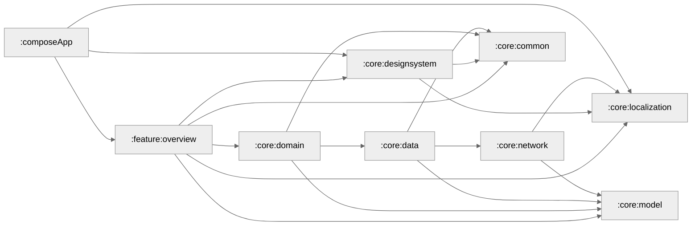

# Portfolio
`Portfolio` is a multi-module Kotlin and Compose Multiplatform app that shows a developer's professional life portfolio overview.
Its structure is inspired by [fethij](https://github.com/fethij/Rijksmuseum/).

## Design
Design is inspired by [Hashir Shoaib](https://hashirshoaeb.com/portfolio/).
App icon was generated by [OpenArt](https://openart.ai/).


## Tech Stack 📚
- [Kotlin Multiplatform](https://kotlinlang.org/lp/multiplatform/)
- [Compose Multiplatform](https://www.jetbrains.com/lp/compose-multiplatform/)
- [Kotlin Coroutines](https://github.com/Kotlin/kotlinx.coroutines)
- [Koin](https://insert-koin.io/)
- [Coil](https://coil-kt.github.io/coil/)
- [Ktor](https://ktor.io/)
- [Compose Navigation](https://developer.android.com/develop/ui/compose/navigation)
- [Jetpack Lifecycle](https://developer.android.com/jetpack/androidx/releases/lifecycle)
- [Jetpack ViewModel](https://developer.android.com/topic/libraries/architecture/viewmodel)


## Development :gear:

Make sure to add your key to `secrets.properties` file.
In order to sign your builds generate `portfolio.jks` keystore and add keystore password, alias and store password in `secrets.properties`.

secrets.properties would look like this:
```
portfolio.api.host=#Add your API host url
portfolio.keystore.password=#Add your keystore password
portfolio.key.alias=#Add your key alias
portfolio.key.password=#Add your key password
```

### Module Graph


